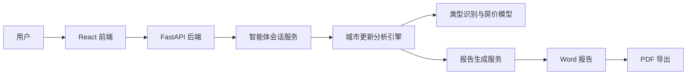

# CityRenew Agent

CityRenew Agent 是一款面向城市更新前期策划场景的智能体应用，支持通过自然语言对话输入项目位置、现状问题、更新目标和补充资料，完成项目研判、区位与客群分析、房价与产业诊断、更新类型判断、策略建议生成，并输出城市更新前期策划报告。

## 一、项目简介

城市更新前期策划涉及大量空间数据、人口与产业数据、房价数据与政策资料的综合研判，传统流程依赖人工查阅资料、逐项测算，周期长、口径不统一。CityRenew Agent 面向这一场景，将"资料驱动 + 数据分析 + 证据链 + 报告生成 + 质量门禁"整合为一个可对话的智能体：用户以自然语言描述项目，系统自动完成多维分析、类型识别、策略生成，并产出结构完整、数字可回溯的前期策划报告，辅助前期策划决策。

## 二、核心功能

- 多轮智能体对话
- 项目资料上传与解析
- 城市更新项目综合研判
- 区位、配套、人口、房价、产业多维分析
- 更新类型识别与策略建议
- 报告生成、预览、Word 下载、PDF 导出
- 历史会话管理
- 数据缺失时主动追问与 fail-closed 机制

## 三、系统架构

前端使用 React + Vite 构建对话式工作台；后端基于 FastAPI 提供智能体编排、城市更新分析、模型推理与报告生成服务；类型识别与房价模型在本地完成推理；报告生成服务基于模板填充生成 Word，并经 LibreOffice 转换为 PDF，保证 Word 与 PDF 同源一致。所有数字均来自后端确定性分析结果，外部大模型仅承担语言组织。



## 四、目录结构

```text
CityRenew Agent/
├── backend/        # 后端服务（FastAPI）
│   ├── app/        # 应用源码：api / services / models / schemas / utils
│   ├── scripts/    # 运行与回归脚本
│   ├── requirements.txt
│   └── .env.example
├── frontend/       # 前端应用（React + Vite）
│   ├── src/
│   ├── index.html
│   ├── package.json
│   └── vite.config.js
├── docs/           # 正式提交文档
└── README.md       # 项目说明
```

## 五、运行环境

- Python 3.11+
- Node.js 18+
- LibreOffice（用于 Word 转 PDF）
- FastAPI
- React + Vite

## 六、后端启动

```bash
cd backend
python -m venv .venv
source .venv/bin/activate
pip install -r requirements.txt
uvicorn app.main:app --host 0.0.0.0 --port 8000
```

## 七、前端启动

```bash
cd frontend
npm install
npm run dev
```

## 八、环境变量配置

复制示例环境变量文件为 `.env`，并配置必要的模型与地图服务密钥（请勿将真实密钥提交到仓库）：

```bash
cp backend/.env.example backend/.env
```

## 九、产品使用流程

1. 打开系统
2. 新建对话
3. 输入项目位置、现状问题和更新目标
4. 上传补充资料
5. 智能体完成项目研判
6. 生成前期策划报告
7. 预览报告
8. 下载 Word 或导出 PDF

## 十、文档说明

正式文档位于 `docs/` 文件夹，包括：

- 技术文档
- API 接口文档
- 产品使用说明书
- 项目管理相关文档

## 十一、数据与安全说明

本仓库不包含原始数据、训练语料、模型文件、密钥、数据库文件和报告输出文件。运行所需数据和配置需在本地环境中按规则配置。

## 十二、许可证

本项目用于 CICC 场景开放与行业应用挑战赛参赛展示与评审。
